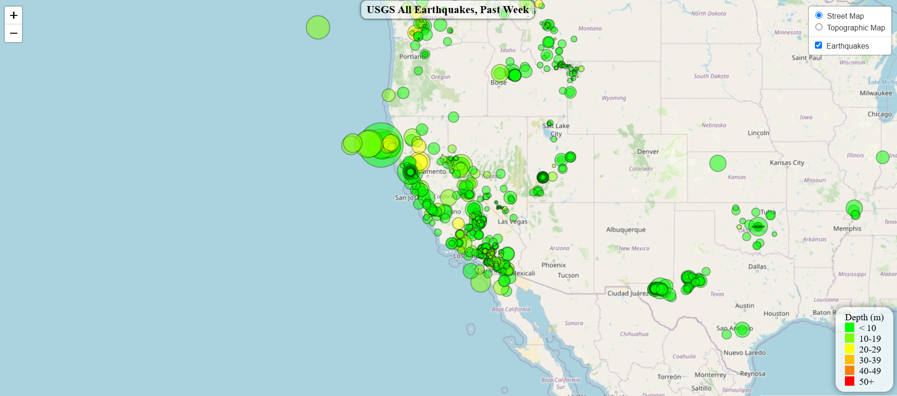

# Earthquake Data Visualization with Leaflet 🌍
[](https://opensource.org/licenses/MIT)


Explore earthquake data from the past week through an interactive map built with [Leaflet.js](https://leafletjs.com/). This project visualizes data from the [USGS Earthquake API](https://earthquake.usgs.gov/earthquakes/feed/v1.0/summary/all_week.geojson), displaying earthquake locations, magnitudes, and depths dynamically.

## 🌐 GitHub Page
[**Earthquake App**](https://danomearawd.github.io/leaflet-challenge/) <br />
You can view the deployed app above:




## 🚀 Features

- **Interactive Map**: Visualizes earthquake data dynamically.
- **Dynamic Markers**:
  - Size scales with earthquake magnitude.
  - Color reflects earthquake depth.
- **Tooltips**: Provide earthquake details (magnitude, depth, location) on click.
- **Legend**: Explains marker colors based on depth levels.

## 📂 Project Structure

```plaintext
leaflet-challenge/
├── index.html            # Web App
├── Leaflet-Part-1/
│   └── static/
│       ├── css/
│       │   └── style.css   # Custom styles for the map
│       └── js/
│           └── logic.js    # JavaScript logic for fetching and visualizing earthquake data
```
## 📝 Summary of Operations

1. **Fetch Earthquake Data**: 
   - The application fetches earthquake data in GeoJSON format from the USGS API.

2. **Data Processing**:
   - The fetched GeoJSON data is parsed to extract relevant information, including the earthquake's magnitude, depth, and location.

3. **Map Initialization**:
   - A map is initialized using Leaflet and tile layers are added to display the map’s background.

4. **Data Visualization**:
   - Earthquake data points are plotted on the map as markers. The size of each marker corresponds to the earthquake's magnitude, and its color reflects the depth of the earthquake.

5. **Tooltips**:
   - When a user clicks on a marker, a tooltip appears, displaying additional information about the earthquake: magnitude, depth, and location.

6. **Legend**:
   - A color-coded legend is displayed to show the relationship between marker colors and earthquake depth.


## 🛠️ Technologies Used

- **HTML/CSS**: Markup and styling to structure and design the webpage and map layout.
- **JavaScript**: Programming language used to implement the functionality for fetching, processing, and displaying earthquake data on the map.
- **Leaflet.js**: A JavaScript library for creating interactive maps, used to visualize the earthquake data.
- **D3.js**: A JavaScript library for manipulating documents based on data, used for loading and displaying the GeoJSON earthquake data.
- **GeoJSON**: A format used for encoding geographic data structures, used to represent the earthquake data.

## 🙋‍♂️ Author

**Dan O'Meara**  
GitHub: [danomearawd](https://github.com/danomearawd)

## 💻 Installation

To get started with this project locally:

1. Clone the repository:
   ```bash
   git clone https://github.com/danomearawd/leaflet-challenge.git
   ```
2. Navigate to the project directory:
   ```bash
   cd leaflet-challenge
   ```
3. Open `index.html` in your browser to view the map and interact with the earthquake data.

### Prerequisites:
- Ensure you have a modern browser with JavaScript enabled.
- An internet connection is required to fetch real-time earthquake data.

